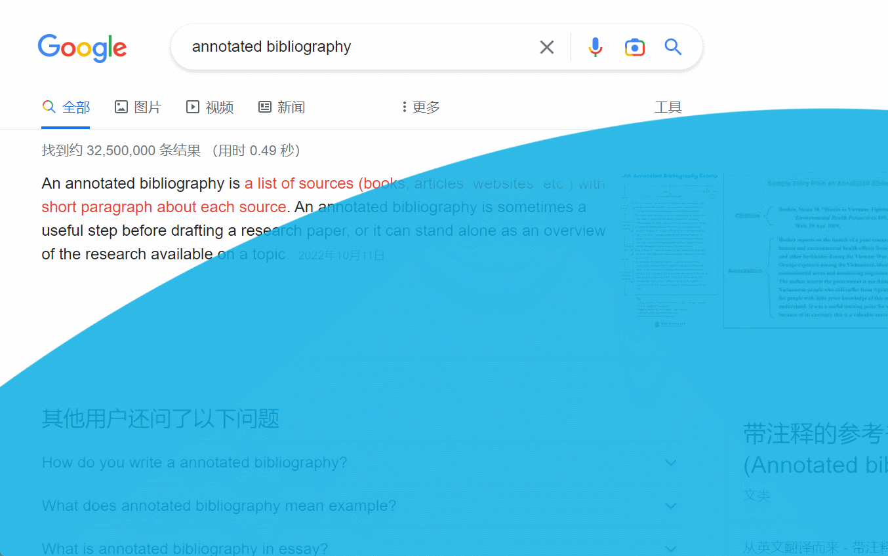

Download the extension from here

[Download the extension from here](https://vivian-xie.github.io/abc-student/mini-projects/mini-project5.zip)

My mini-project 5 is a chrome extension that changes the background of any web page that the user opens. It is a gift to one of my friend Shelly that took cclab. I have to admit that I was inspired by her ocean project using p5js. This project can be easily activated because it doesn’t need any triggering condition. The fish will stay at the left-bottom corner as long as the user doesn’t click the mouse. When the mouse is clicked, the fish will move in a horizontal direction following the position of the mouse. The change of the tide is achieved through the rotation of a blue ellipse. The trick is to put the transition center at a the exactly the right place and spin in a proper speed. The problem is that I’m not using a background script because this project doesn’t necessarily need one due to my intention of making only a background for every page, but I did use  the background script in project 4.